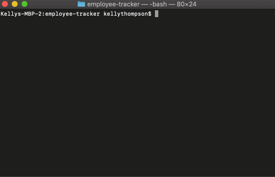

# Employee Tracker

This is a CLI that allows the user to view, track, and update various information about their company. The user can view or add departments, roles, and employees. They can also update the roles of various employees.

## Technologies
Frameworks/Libraries: MySQL, Inquirer